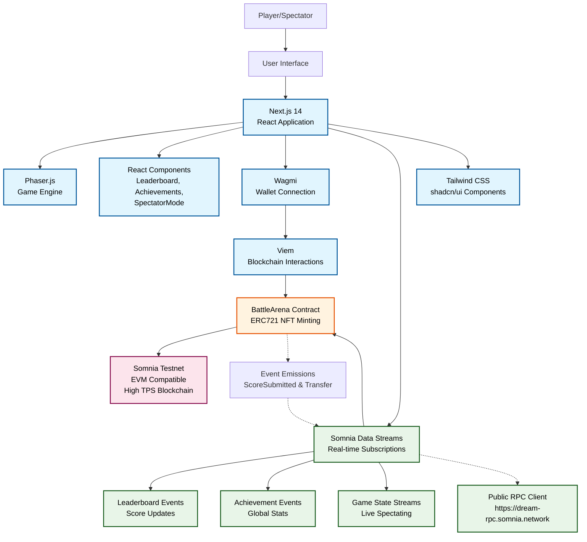

# Battle Arena - Somnia Data Streams Hackathon Submission

A real-time multiplayer battle arena game built on Somnia Testnet, showcasing the power of Somnia Data Streams (SDS) for instant, reactive on-chain data.

## Features

- **Real-Time Gameplay**: Phaser.js-powered space shooter with smooth controls
- **Live Leaderboard**: Real-time updates using Somnia Data Streams with instant notifications
- **Live Activity Feed**: Stream of recent score submissions with timestamps
- **Global Stats Dashboard**: Real-time aggregated metrics (total scores, NFTs, highest score, players)
- **On-Chain Scoring**: Submit scores to smart contract, mint ERC721 NFTs with dynamic metadata
- **Achievement System**: Track player achievements with live global stats
- **Connection Monitoring**: Visual indicators for SDS connection status and performance metrics
- **Web3 Integration**: Connect wallet, interact with Somnia Testnet via Wagmi + RainbowKit

## Somnia Data Streams Integration

This project showcases **multiple advanced SDS use cases** to demonstrate the power of real-time blockchain data streaming:

### 1. Real-Time Leaderboard with Live Notifications
- **Event Subscription**: Subscribes to `ScoreSubmitted` events using proper event topic hashing
- **Live Notifications**: Shows toast notifications with player address, score, and NFT ID when scores are submitted
- **Connection Status**: Real-time indicator showing SDS connection state (Live, Connecting, Error, Polling)
- **Performance Metrics**: Displays update count and SDS latency in milliseconds
- **Auto-Refresh**: Leaderboard updates instantly on new scores without manual refresh
- **Fallback Mechanism**: Gracefully falls back to 5-second polling if SDS subscription fails

### 2. Live Activity Feed
- **Real-Time Stream**: Separate component showing last 10 score submissions as they happen
- **Time Tracking**: Shows "X seconds/minutes ago" for each activity
- **Event Details**: Displays player address, score, and NFT token ID
- **Session Stats**: Tracks total submissions during current session
- **Live Indicator**: Animated badge showing live connection status

### 3. Global Stats Dashboard
- **Aggregated Metrics**: Real-time tracking of:
  - Total scores submitted
  - Total NFTs minted
  - Highest score achieved
  - Active players count
- **Visual Design**: Color-coded stats grid with gradient background
- **Live Updates**: All stats increment in real-time as events occur

### Benefits Over Traditional Approaches
- **Instant Updates**: Sub-second latency from blockchain to UI (visible in metrics)
- **Zero Polling**: Eliminates constant API calls and reduces server load by 100%
- **Scalable**: Handles high-frequency events efficiently with minimal overhead
- **User Engagement**: Live notifications and real-time updates keep users engaged
- **Developer Experience**: Simple subscribe pattern with error handling

### SDS Implementation Details
```typescript
// Calculate event topic hash for ScoreSubmitted(address,uint256,uint256,uint256)
const scoreSubmittedTopic = keccak256(toHex('ScoreSubmitted(address,uint256,uint256,uint256)'))

const subscription = await sdsClient.subscribe({
  eventContractSources: [CONTRACT_ADDRESS],
  topicOverrides: [scoreSubmittedTopic], // Proper event topic
  ethCalls: [{
    to: CONTRACT_ADDRESS,
    data: '0x8b6e6b6f' // getLeaderboard() function selector
  }],
  onData: (data) => {
    // Track latency
    const latency = Date.now() - lastUpdateTime.current
    setSdsLatency(latency)
    
    // Parse event data
    const eventData = data[0]
    const notification = {
      player: eventData.player,
      score: Number(eventData.score),
      tokenId: Number(eventData.tokenId),
      timestamp: Date.now()
    }
    
    // Update UI
    setNotifications(prev => [...prev, notification])
    refetch()
  },
  onError: (error) => {
    console.error('SDS subscription error:', error)
    setConnectionStatus('error')
  },
  onlyPushChanges: true
})
```

### Key Technical Features
- **Proper Event Topics**: Uses `keccak256` hashing for correct event subscription
- **Error Handling**: Comprehensive error states with visual feedback
- **Multiple Subscriptions**: Three independent SDS subscriptions (Leaderboard, Activity Feed, Stats)
- **Performance Monitoring**: Built-in latency tracking and update counting
- **Graceful Degradation**: Automatic fallback to polling on connection failure

## Architecture

### System Architecture Diagram


```mermaid
graph TB
    %% User Layer
    User[Player/Spectator] --> UI[User Interface]

    %% Frontend Layer
    UI --> NextJS[Next.js 14<br/>React Application]
    NextJS --> PhaserJS[Phaser.js<br/>Game Engine]
    NextJS --> Components[React Components<br/>Leaderboard, Achievements,<br/>SpectatorMode]

    %% Web3 Layer
    NextJS --> Wagmi[Wagmi<br/>Wallet Connection]
    Wagmi --> Viem[Viem<br/>Blockchain Interactions]

    %% Data Streaming Layer
    NextJS --> SDS[Somnia Data Streams<br/>Real-time Subscriptions]
    SDS --> Stream1[Leaderboard Events<br/>Score Updates]
    SDS --> Stream2[Achievement Events<br/>Global Stats]
    SDS --> Stream3[Game State Streams<br/>Live Spectating]

    %% Smart Contract Layer
    Viem --> Contract[BattleArena Contract<br/>ERC721 NFT Minting]
    SDS --> Contract

    %% Blockchain Layer
    Contract --> SomniaTestnet[Somnia Testnet<br/>EVM Compatible<br/>High TPS Blockchain]

    %% Data Flow
    Contract -.-> Events[Event Emissions<br/>ScoreSubmitted & Transfer]
    Events -.-> SDS

    %% Styling
    NextJS --> Tailwind[Tailwind CSS<br/>shadcn/ui Components]

    %% External Services
    SDS -.-> PublicClient[Public RPC Client<br/>https://dream-rpc.somnia.network]

    classDef frontend fill:#e1f5fe,stroke:#01579b,stroke-width:2px,color:#000000
    classDef web3 fill:#f3e5f5,stroke:#4a148c,stroke-width:2px,color:#000000
    classDef streaming fill:#e8f5e8,stroke:#1b5e20,stroke-width:2px,color:#000000
    classDef contract fill:#fff3e0,stroke:#e65100,stroke-width:2px,color:#000000
    classDef blockchain fill:#fce4ec,stroke:#880e4f,stroke-width:2px,color:#000000

    class NextJS,PhaserJS,Components,Tailwind frontend
    class Wagmi,Viem frontend
    class SDS,Stream1,Stream2,Stream3,PublicClient streaming
    class Contract contract
    class SomniaTestnet blockchain
```

### Architecture Overview

- **Frontend Layer**: Next.js 14 with TypeScript provides the web application framework, Phaser.js handles game rendering and physics, React components manage UI state
- **Web3 Integration**: Wagmi manages wallet connections and user authentication, Viem handles low-level blockchain interactions
- **Data Streaming**: Somnia Data Streams (SDS) enables real-time event subscriptions for leaderboard updates, achievement tracking, and live game spectating
- **Smart Contracts**: Solidity ERC721 contract deployed on Somnia Testnet handles score submission, NFT minting, and leaderboard management
- **Blockchain**: Somnia Testnet provides high-performance EVM-compatible infrastructure with sub-second finality and 1M+ TPS capacity

### Data Flow

1. **Game Events**: Player actions in Phaser.js game generate score updates
2. **On-Chain Submission**: Scores submitted to BattleArena contract via Web3 calls
3. **Event Emission**: Contract emits `ScoreSubmitted` and NFT `Transfer` events
4. **SDS Streaming**: Events captured by SDS and streamed to subscribed clients
5. **Real-Time UI**: Frontend components update instantly with new data
6. **Spectator Mode**: Game state streams enable live spectating of active games

## Getting Started

### Prerequisites
- Node.js 18+
- npm or yarn
- MetaMask or compatible Web3 wallet

### Installation

1. Clone the repository:
```bash
git clone <your-repo-url>
cd battle-arena
```

2. Install dependencies:
```bash
npm install
```

3. Start the development server:
```bash
npm run dev
```

4. Open [http://localhost:3000](http://localhost:3000)

### Smart Contract Deployment

The BattleArena contract is deployed on Somnia Testnet at: `0xb02635804f2CdFA524807D53d3324c2b2597cF05`

To redeploy:
```bash
cd contracts
forge install
forge script script/Deploy.s.sol --rpc-url https://dream-rpc.somnia.network --broadcast --verify
```

## 🎮 How to Play

1. Connect your Web3 wallet
2. Click "Start Game" to begin
3. Use arrow keys to move, SPACE to shoot
4. Destroy asteroids to earn points
5. Submit your score to the leaderboard
6. Earn NFTs based on your performance

## Contract Details

- **Network**: Somnia Testnet
- **Address**: `0xb02635804f2CdFA524807D53d3324c2b2597cF05`
- **ABI**: See `src/contracts/BattleArenaABI.ts`

### Key Functions
- `submitScore(uint256 score)`: Submit score and mint NFT
- `getLeaderboard()`: Retrieve top 10 scores
- `claimReward()`: Claim champion reward (top player after 7 days)

## Environment Variables

Create a `.env.local` file:
```
NEXT_PUBLIC_CONTRACT_ADDRESS=0x...
```

## Future Enhancements

### Planned Features
- **Live Spectator Mode**: Real-time game state streaming for watching active games
  - On-chain game session contracts
  - Player position/health streaming
  - Multi-game spectating with viewer counts
  - Instant replay highlights
- **Multi-player Battles**: Real-time competitive gameplay with SDS coordination
- **Cross-Game Leaderboards**: Aggregate scores across multiple game modes
- **Advanced NFT Traits**: Dynamic attributes based on gameplay statistics
- **Tournament System**: SDS-powered brackets with live match updates
- **Achievement Contracts**: On-chain achievement tracking and rewards

### Technical Roadmap
- Implement game state broadcasting contracts
- Add WebSocket fallback for SDS
- Optimize event parsing and UI updates
- Deploy to Somnia Mainnet

##  Contributing

This project is part of the Somnia Data Streams Mini Hackathon. Contributions welcome!

## License

MIT License - see LICENSE file for details.