# Battle Arena - Somnia Data Streams Hackathon Submission

A real-time multiplayer battle arena game built on Somnia Testnet, showcasing the power of Somnia Data Streams (SDS) for instant, reactive on-chain data.

## Features

- **Real-Time Gameplay**: Phaser.js-powered space shooter with smooth controls
- **Live Leaderboard**: Real-time updates using Somnia Data Streams (SDS)
- **On-Chain Scoring**: Submit scores to smart contract, mint NFTs
- **Achievement System**: Unlock rewards based on performance
- **Web3 Integration**: Connect wallet, interact with Somnia Testnet

## Somnia Data Streams Integration

This project leverages SDS to transform on-chain data into live, reactive streams:

### Real-Time Leaderboard Updates
- **Event Subscription**: Subscribes to `ScoreSubmitted` events from the BattleArena contract
- **Schema Definition**: Uses structured schema for efficient data streaming:
  ```
  uint64 timestamp, address user, uint256 score
  ```
- **Reactive UI**: Leaderboard updates instantly when new scores are submitted, without polling
- **Fallback Mechanism**: Gracefully falls back to 5-second polling if SDS subscription fails

### Benefits Over Traditional Approaches
- **Instant Updates**: No delays between on-chain events and UI updates
- **Reduced Load**: Eliminates constant API calls and polling overhead
- **Scalable**: Handles high-frequency events efficiently
- **Real-Time UX**: Provides live, responsive user experience

### SDS Implementation Details
```typescript
const subscription = await sdsClient.subscribe({
  eventContractSources: [CONTRACT_ADDRESS],
  topicOverrides: ['0x...'], // ScoreSubmitted event topic
  ethCalls: [{
    to: CONTRACT_ADDRESS,
    data: '0x...' // getLeaderboard function call
  }],
  onData: (data) => {
    refetch() // Update leaderboard on new score
  },
  onError: (error) => {
    console.error('SDS subscription error:', error)
  },
  onlyPushChanges: true
})
```

## Architecture

### System Architecture Diagram

```mermaid
graph TB
    %% User Layer
    User[ Player/Spectator] --> UI[🎮 User Interface]

    %% Frontend Layer
    UI --> NextJS[ Next.js 14<br/>React Application]
    NextJS --> PhaserJS[ Phaser.js<br/>Game Engine]
    NextJS --> Components[📱 React Components<br/>Leaderboard, Achievements,<br/>SpectatorMode]

    %% Web3 Layer
    NextJS --> Wagmi[ Wagmi<br/>Wallet Connection]
    Wagmi --> Viem[⚡ Viem<br/>Blockchain Interactions]

    %% Data Streaming Layer
    NextJS --> SDS[🌊 Somnia Data Streams<br/>Real-time Subscriptions]
    SDS --> Stream1[📊 Leaderboard Events<br/>Score Updates]
    SDS --> Stream2[🏆 Achievement Events<br/>Global Stats]
    SDS --> Stream3[🎮 Game State Streams<br/>Live Spectating]

    %% Smart Contract Layer
    Viem --> Contract[📋 BattleArena Contract<br/>ERC721 NFT Minting]
    SDS --> Contract

    %% Blockchain Layer
    Contract --> SomniaTestnet[⛓️ Somnia Testnet<br/>EVM Compatible<br/>High TPS Blockchain]

    %% Data Flow
    Contract -.-> Events[📡 Event Emissions<br/>ScoreSubmitted & Transfer]
    Events -.-> SDS

    %% Styling
    NextJS --> Tailwind[💅 Tailwind CSS<br/>shadcn/ui Components]

    %% External Services
    SDS -.-> PublicClient[🌐 Public RPC Client<br/>https://dream-rpc.somnia.network]

    classDef frontend fill:#e1f5fe,stroke:#01579b,stroke-width:2px,color:#000000
    classDef web3 fill:#f3e5f5,stroke:#4a148c,stroke-width:2px,color:#000000
    classDef streaming fill:#e8f5e8,stroke:#1b5e20,stroke-width:2px,color:#000000
    classDef contract fill:#fff3e0,stroke:#e65100,stroke-width:2px,color:#000000
    classDef blockchain fill:#fce4ec,stroke:#880e4f,stroke-width:2px,color:#000000

    class NextJS,PhaserJS,Components,Tailwind frontend
    class Wagmi,Viem frontend
    class SDS,Stream1,Stream2,Stream3,PublicClient streaming
    class Contract contract
    class SomniaTestnet blockchain
```



### Architecture Overview

- **Frontend Layer**: Next.js 14 with TypeScript provides the web application framework, Phaser.js handles game rendering and physics, React components manage UI state
- **Web3 Integration**: Wagmi manages wallet connections and user authentication, Viem handles low-level blockchain interactions
- **Data Streaming**: Somnia Data Streams (SDS) enables real-time event subscriptions for leaderboard updates, achievement tracking, and live game spectating
- **Smart Contracts**: Solidity ERC721 contract deployed on Somnia Testnet handles score submission, NFT minting, and leaderboard management
- **Blockchain**: Somnia Testnet provides high-performance EVM-compatible infrastructure with sub-second finality and 1M+ TPS capacity

### Data Flow

1. **Game Events**: Player actions in Phaser.js game generate score updates
2. **On-Chain Submission**: Scores submitted to BattleArena contract via Web3 calls
3. **Event Emission**: Contract emits `ScoreSubmitted` and NFT `Transfer` events
4. **SDS Streaming**: Events captured by SDS and streamed to subscribed clients
5. **Real-Time UI**: Frontend components update instantly with new data
6. **Spectator Mode**: Game state streams enable live spectating of active games

## Getting Started

### Prerequisites
- Node.js 18+
- npm or yarn
- MetaMask or compatible Web3 wallet

### Installation

1. Clone the repository:
```bash
git clone <your-repo-url>
cd battle-arena
```

2. Install dependencies:
```bash
npm install
```

3. Start the development server:
```bash
npm run dev
```

4. Open [http://localhost:3000](http://localhost:3000)

### Smart Contract Deployment

The BattleArena contract is deployed on Somnia Testnet at: `0xb02635804f2CdFA524807D53d3324c2b2597cF05`

To redeploy:
```bash
cd contracts
forge install
forge script script/Deploy.s.sol --rpc-url https://dream-rpc.somnia.network --broadcast --verify
```

## 🎮 How to Play

1. Connect your Web3 wallet
2. Click "Start Game" to begin
3. Use arrow keys to move, SPACE to shoot
4. Destroy asteroids to earn points
5. Submit your score to the leaderboard
6. Earn NFTs based on your performance

## Contract Details

- **Network**: Somnia Testnet
- **Address**: `0xb02635804f2CdFA524807D53d3324c2b2597cF05`
- **ABI**: See `src/contracts/BattleArenaABI.ts`

### Key Functions
- `submitScore(uint256 score)`: Submit score and mint NFT
- `getLeaderboard()`: Retrieve top 10 scores
- `claimReward()`: Claim champion reward (top player after 7 days)

## Environment Variables

Create a `.env.local` file:
```
NEXT_PUBLIC_CONTRACT_ADDRESS=0x...
```

## Future Enhancements

- Multi-player real-time battles
- Cross-game leaderboards
- Advanced NFT traits based on gameplay
- Tournament system with SDS-powered brackets

##  Contributing

This project is part of the Somnia Data Streams Mini Hackathon. Contributions welcome!

## License

MIT License - see LICENSE file for details.